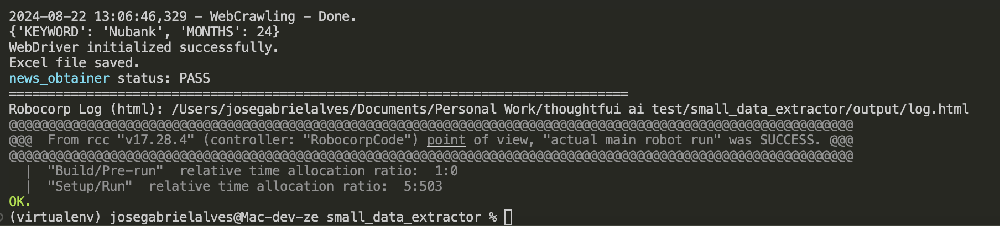
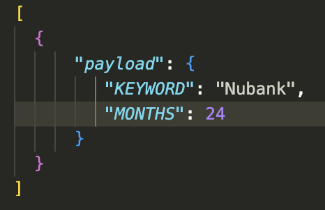

# ThoughtfulAI Challenge - Basic News Webcrawler

Webcrawler that goes to Reuters' homepage and tries to search for news inside a time period, given a keyword and the months to search.

## Initial thoughts

The program has the following hard requisites:

1. ### Hard python/selenium only. 
   - I tried implementing a custom selenium wrapper here to use just what I needed from it, and with that, came some other problems: It was running locally and in an EC2 instance I used, but not in robocorp workers as the challenge asked for. Debugging it further revealed that the robocorp workers were getting blocked by the website ¯\\__(ツ)\__/¯
  
2. ### No APIs or Requests
   -  Yeah, self explanatory. Instead of downloading the news thumbnails I went from screenshotting them.

## How it works

The crawler started as a minimal robocorp robot as a template, and from there I implemented the pure selenium approach the best I could.

It gets the parameters as work items from robocorp, starts the task, goes to https://www.reuters.com, clicks the search button, types the keyword received in the work item, starts crawling through the search results, saving the date, title, category, image and image url, whether it has money on the title and how many times the keyword was appearing in the title.

As there are lots of counter measures to crawling and scraping in these big sites, it works 90% of the time and fails if encounters a captcha screen.

## How to make it work

At first I thought I had to create its own python virtual env, but robocorp's VSCode extension does that for you quickly enough. You just gotta type the dependencies in the conda.yaml at the repo's root.

To run the code:

1. Install [Robocorp Code VSCode Extension](https://robocorp.com/docs/visual-studio-code)

2. Clone this repository your preferred way
3. Open the cloned repo locally on github
4. Use the extension to Run Task.

If the crawler doesnt get blocked, your terminal will look like this when finished:

Your results are stored in the `/output` forlder in the root of the repository.

Now, the results are for `"KEYWORD"= 'Nubank'` and `"MONTHS" = 24`. 
To change it:

- Open `work-items.json` inside `root/dev-data/parameters/`

- Change `"Nubank"`to `"Whatever keyword you want crawled"` 
- And change `24`to the number of months you want.

### Thanks for your time!

#### Cat tax:

